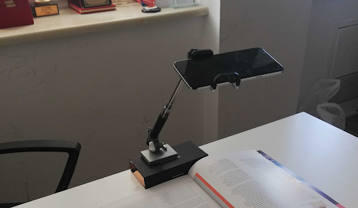
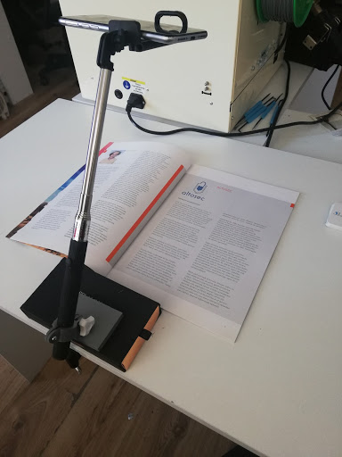

[//]: # (____________________________________PROJECT TITLE____________________________________)

 

<h1 >MonReader
  

[//]: # (____________________________________BACKGROUND____________________________________)

<h2> Background:
  

Our company develops innovative Artificial Intelligence and Computer Vision solutions that revolutionize industries. Machines that can see: We pack our solutions in small yet intelligent devices that can be easily integrated to your existing data flow. Computer vision for everyone: Our devices can recognize faces, estimate age and gender, classify clothing types and colors, identify everyday objects and detect motion. Technical consultancy: We help you identify use cases of artificial intelligence and computer vision in your industry. Artificial intelligence is the technology of today, not the future.

MonReader is a new mobile document digitization experience for the blind, for researchers and for everyone else in need for fully automatic, highly fast and high-quality document scanning in bulk. It is composed of a mobile app and all the user needs to do is flip pages and everything is handled by MonReader: it detects page flips from low-resolution camera preview and takes a high-resolution picture of the document, recognizing its corners and crops it accordingly, and it dewarps the cropped document to obtain a bird's eye view, sharpens the contrast between the text and the background and finally recognizes the text with formatting kept intact, being further corrected by MonReader's ML powered redactor.

<h1 align="center"></h1>

MonReader is a new mobile document digitalization experience for the blind, for researchers and for everyone else in need for fully automatic, highly fast and high-quality document scanning in bulk. It is composed of a mobile app and all the user needs to do is flip pages and everything is handled by MonReader: it detects page flips from low-resolution camera preview and takes a high-resolution picture of the document, recognizing its corners and crops it accordingly, and it dewarps the cropped document to obtain a bird's eye view, sharpens the contrast between the text and the background and finally recognizes the text with formatting kept intact, being further corrected by MonReader's ML powered redactor.

<h1 align="center"></h1>

[//]: # (____________________________________DATA DESCRIPTION____________________________________)

## Data Description:

We collected page flipping video from smart phones and labelled them as flipping and not flipping.

We clipped the videos as short videos and labelled them as flipping or not flipping. The extracted frames are then saved to disk in a sequential order with the following naming structure: VideoID_FrameNumber.

[//]: # (____________________________________ATTRIBUTES____________________________________)

## Goal(s)::

Predict if the page is being flipped using a single image.

[//]: # (____________________________________PROJECT OVERVIEW____________________________________)

## Project Overview:

I used 5 different strategies to find the similarities between the targeted sentences and each job title as follows:

1. **`TF-IDF`**.

2. **`GloVe `**.

3. **`Word2Vec`** ==> `Google News` model.

4. **`FastText`**.

5. **`BERT`**.

**BERT** model was one of the best model to find the similarity between our data and the targeted phrase **(aspiring human resources)** as we can see the next images.

<h1 align="center">
  
</h1>

<h1 align="center">
  
</h1>

As for the Ranking model, I run the RankNet model on the data and our best loos score is 48%. I believe the data size play a major role to get this result, even TF-IDF gives us a more reliable result in my opinion than the RankNet model as in the next image.

<h1 align="center">
  
</h1>
