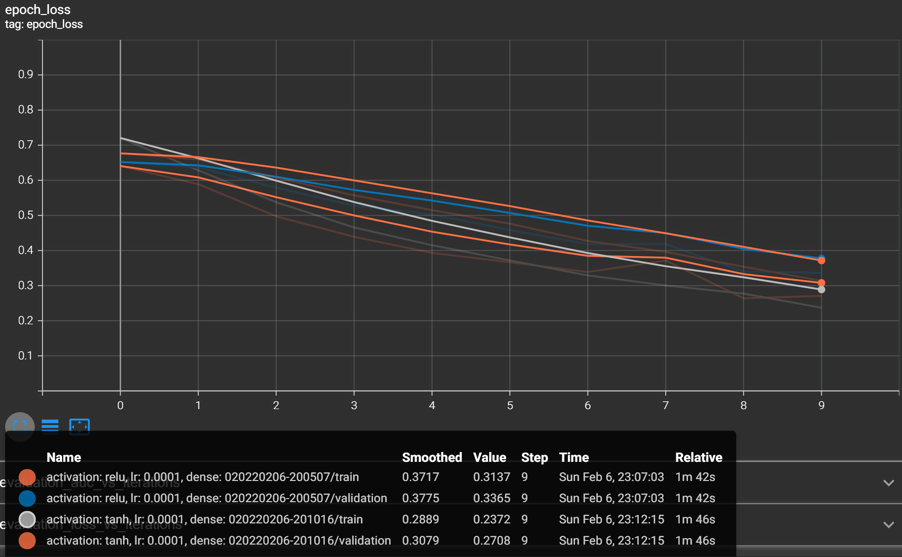
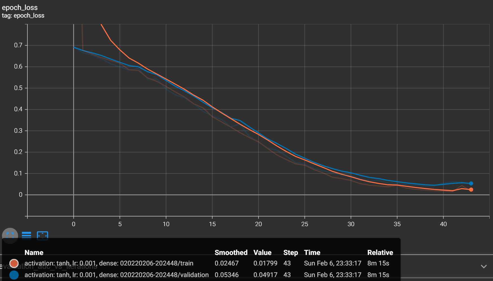

  
  
[//]: # (____________________________________PROJECT TITLE____________________________________)

 

<h1 >MonReader</h1>
 

   

[//]: # (____________________________________BACKGROUND____________________________________)

## Background:

Our company develops innovative Artificial Intelligence and Computer Vision solutions that revolutionize industries. Machines that can see: We pack our solutions in small yet intelligent devices that can be easily integrated to your existing data flow. Computer vision for everyone: Our devices can recognize faces, estimate age and gender, classify clothing types and colors, identify everyday objects and detect motion. Technical consultancy: We help you identify use cases of artificial intelligence and computer vision in your industry. Artificial intelligence is the technology of today, not the future.

MonReader is a new mobile document digitization experience for the blind, for researchers and for everyone else in need for fully automatic, highly fast and high-quality document scanning in bulk. It is composed of a mobile app and all the user needs to do is flip pages and everything is handled by MonReader: it detects page flips from low-resolution camera preview and takes a high-resolution picture of the document, recognizing its corners and crops it accordingly, and it dewarps the cropped document to obtain a bird's eye view, sharpens the contrast between the text and the background and finally recognizes the text with formatting kept intact, being further corrected by MonReader's ML powered redactor.

 

  

MonReader is a new mobile document digitalization experience for the blind, for researchers and for everyone else in need for fully automatic, highly fast and high-quality document scanning in bulk. It is composed of a mobile app and all the user needs to do is flip pages and everything is handled by MonReader: it detects page flips from low-resolution camera preview and takes a high-resolution picture of the document, recognizing its corners and crops it accordingly, and it dewarps the cropped document to obtain a bird's eye view, sharpens the contrast between the text and the background and finally recognizes the text with formatting kept intact, being further corrected by MonReader's ML powered redactor.

 

  

[//]: # (____________________________________DATA DESCRIPTION____________________________________)

## Data Description:

We collected page flipping video from smart phones and labelled them as flipping and not flipping.

We clipped the videos as short videos and labelled them as flipping or not flipping. The extracted frames are then saved to disk in a sequential order with the following naming structure: VideoID_FrameNumber.

  

[//]: # (____________________________________ATTRIBUTES____________________________________)

## Goal(s)::

Predict if the page is being flipped using a single image.

  

[//]: # (____________________________________PROJECT OVERVIEW____________________________________)

## Project Overview:

### data preprocessing:

The original data set size was `1080 * 1920` pixels with two classes, `flip` and `notflip` class as in the following picture.

As for the preprocessing, the data size was reduced to `100 * 70` pixels and scaling was applied by dividing the pixels by **225**. The result is shown in the next image.

 

### Modeling:

  - ### **1) Model Architecture**
      The model consists of 2 CNN layers, 2 Max Pooling layers with 2*2 and finally 2 dense layers.
      

 

  - ### **2) Training and Optimization**:
    The model was tested with different hyperparameters like:
      - `tanh` and `relu` as activation functions.
      - `0.0001`, `0.001` and `0.1` as a learning rate.

      All of the models accuracy and loss scores are shown in the following images:

      

 

      

 

      In order to compare the models, I will compare them based on the learning rate. First of all, the loss scores with **0.0001** learning rate, we can see the loss decreased with the time gradually and the `thanh` activation function perform better than the `relu`. In the second image, we can see the loss score for the **0.001** learning rate. From the figure, it's clear that the `tanh` activation function exceeds the `relu`, not in the final score only but also in how fast it decreased. And in the final image, the learning rate was the biggest one which is **0.1**. It's clear from the image, this is the worst learning rate for this data with both of `relu` and `tanh` activation functions.

      

 

      

 

      

 

      Therefore, both of **tanh** activation function and **0.001** learning rate was chosen for the final model. As we can see in the first image, the final accuracy score for the training images is `100%` and `99.9%` for the validation images. In the second picture, the training loss was `0.017` and `0.04` for validation images.

      

 

      

 

        
      
  - ### **3) Testing**
      The accuracy for the test data is `99.7%`, and the confusion matrix confirms that. It looks like the model performs slightly better in the `flip` class more than `not flip` and this is can be justified by the difference between the number of images in each class.

      

 

[//]: # (&#40;____________________________________ CONCLUSION____________________________________&#41;)

## Conclusion:

Different model hyperparameters were tested and in general, some of the models prefer well in the range of **10** epochs. From the training and optimization section, it's clear this data prefer a learning rate of around 0.001 and tanh activation function better than relu. Our best model test score is `99.7%` with a loss equal to `0.046`.

